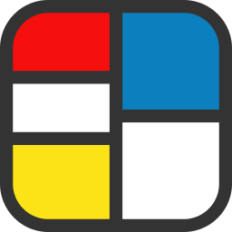
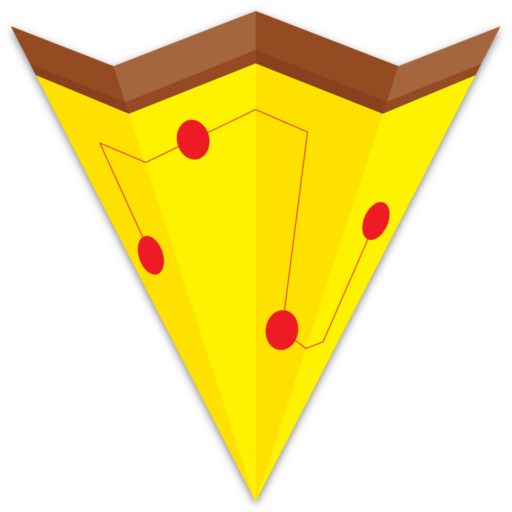

<!--
**csandman/csandman** is a ✨ _special_ ✨ repository because its `README.md` (this file) appears on your GitHub profile.

Here are some ideas to get you started:

- 🔭 I’m currently working on ...
- 🌱 I’m currently learning ...
- 👯 I’m looking to collaborate on ...
- 🤔 I’m looking for help with ...
- 💬 Ask me about ...
- 📫 How to reach me: ...
- 😄 Pronouns: ...
- ⚡ Fun fact: ...
-->

Hi! My name is Chris, and I'm a front end focused full stack developer specializing in React using the Next.js framework. I really love everything JavaScript (and TypeScript), from Node.js backends to Puppeteer automations to browser extensions. I also enjoy aggregating, normalizing, and presenting data through web scraping or other means.

Most of my personal projects are open source, but here are a few that are not:

<h2 vertical-align="middle"> Screenshotr - <a href="https://screenshotr.app/">https://screenshotr.app/</a></h2>

Screenshotr is a tool for designers, developers, and marketers with the purpose of creating browser and mobile mockups of different websites or apps. They can be used in blog posts, portfolios, social media posts, etc to add some flare. You can get started by typing in a URL to have it pull a screenshot for you, or uploading a screenshot by pasting it, dropping it on the screen, or clicking the upload button in the top right.

<h2 vertical-align="middle"> Slice Map - <a href="https://slicemap.com/">https://slicemap.com/</a></h2>

I created Slice Map to filter out all the pizza places in NYC you don't want to eat at — any that cost more than $1! Out and about after a late night? Pull up Slice Map, filter by "Open Now", And find the closest option to you!

Do you know of any I might have missed? Fill out the submission form and once verified, it will be added to the site!

